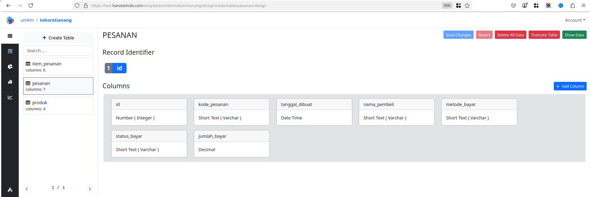
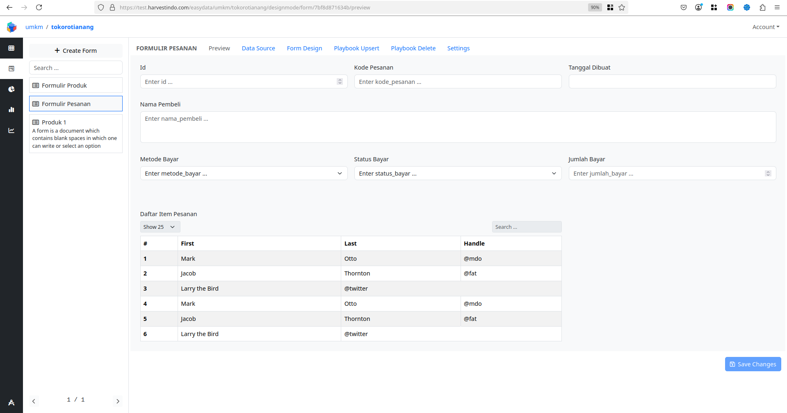
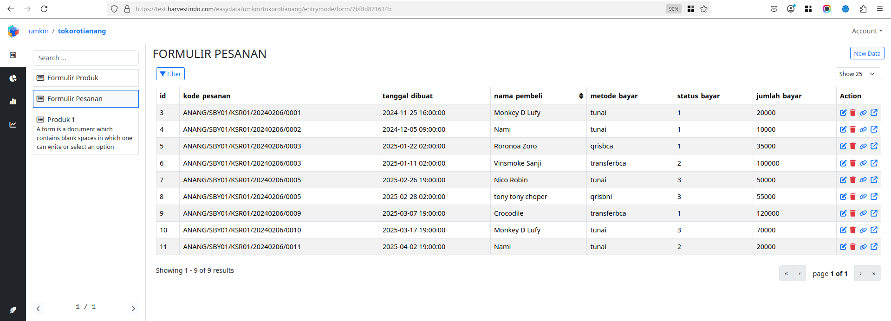
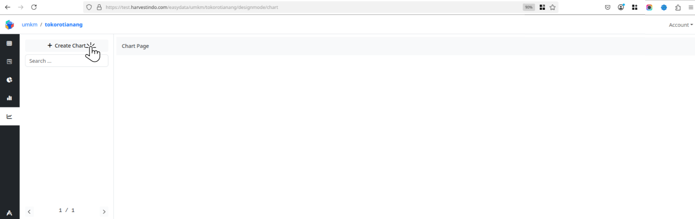
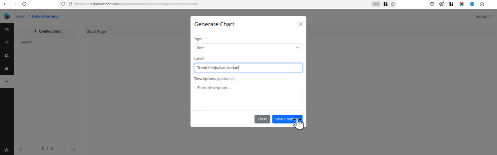
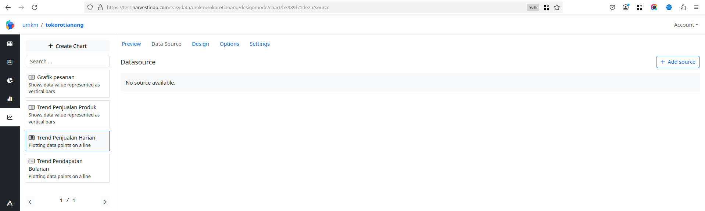
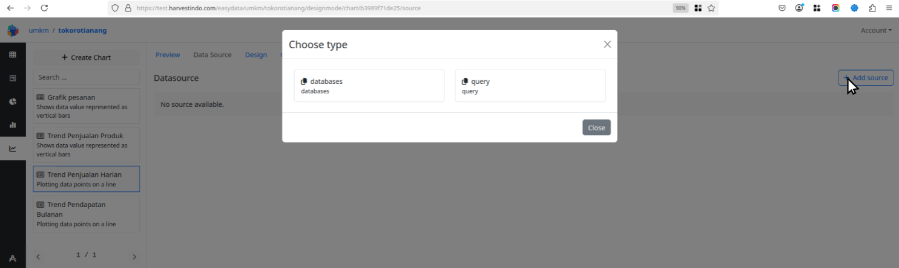
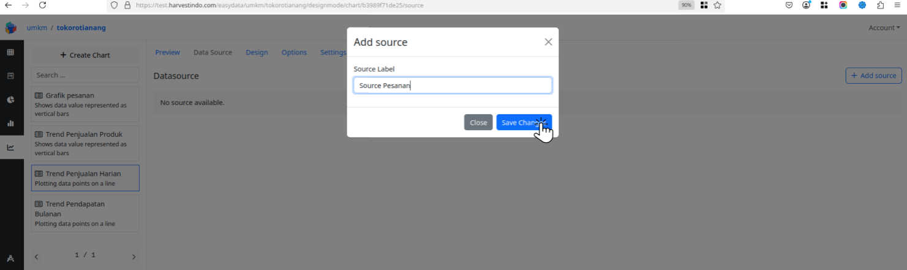

# Merancang Diagram

Terdapat berbagai tipe diagram yang bisa anda buat pada menu **Desain Diagram** seperti diagram batang, diagram garis, diagram lingkaran dan sebagainya. Sebuah diagram dibangun berdasarkan data-data dari tabel data yang sudah ditetapkan sebagai sumber data dari diagram tersebut. Oleh karena itu sebelum memulai merancang diagram, anda hrus sudah memiliki tabel data yang akan dijadikan sebagai sumber data pada desain diagram.


## Mempersiapkan tabel data yang akan digunakan untuk merancang diagram

1. Buka menu **Proyek > Desain > Tabel** dan buat tabel baru dengan nama "**pesanan**" sebagai berikut:
2. Buka menu **Proyek > Desain > Formulir** dan buat sebuah formulir dengan nama "**Formulir Pesanan**" untuk menambahkan data pada tabel data 
3. Buka menu **Proyek > Entry > Formulir** dan tambahkan beberapa data pada "**Formulir Pesanan**" 


## Membuat desain diagram baru

1. Buka menu **Proyek > Desain > Chart** dan klik tombol "**+ Create Chart**" 
2. Silahkan pilih chart type, enter chart label dengan nama diagram **Trend Penjualan harian**, enter chart description, dan klik tombol "**Save Changes**" untuk menyimpan perubahan 
3. Buka diagram **Trend Penjualan Harian** yang baru saja dibuat untuk memulai merancang diagram. 


## Merancang sumber data pada menu desain diagram

Pada menu "**Sumber Data**" anda dapat menyusun sumber data dengan menambahkan langsung dari *database* atau menuliskan *query* secara langsung. pada panduan ini akan menggunakan sumber data yang disusun dengan menuliskan *query* secara langsung untuk dapat menyusun sumber data sesuai kebutuhan dalam merancang diagram.

### Menyusun sumber data dengan menambahkan langsung dari *database*  

1. Buka menu **Proyek > Desain > Diagram > Sumber Data** 
2. Tambahkan sumber data baru dengan klik tombol "**+ Add Source**" dan pilih tipe ***database*** 
3. Berikan label **Source Pesanan** sebagai identifier untuk sumber data yang akan dibuat dan klik tombol "**Save Change**" untuk menyimpan perubahan 
4. Tambahkan kolom pada sumber data dengan klik tombol ***Add Column*** 
5. Pilih kolom yang ingin digunakan, masukkan label, dan klik tombol "**Save Changes**" untuk menyimpan perubahan
6. Tambahkan semua kolom yang akan digunakan untuk merancang diagram dengan mengulangi langkah 4 dan 5. 


```
SELECT
    YEAR(tanggal_dibuat) AS tahun,
    MONTH(tanggal_dibuat) AS bulan,
    DAY(tanggal_dibuat) AS hari,
    COUNT(*) AS jumlah_transaksi,
    SUM(jumlah_bayar) AS total_jumlah
FROM
    pesanan
GROUP BY
    YEAR(tanggal_dibuat),
    MONTH(tanggal_dibuat)
ORDER BY
    tahun ASC, bulan ASC
```

