# Merancang sumber data pada desain formulir

Pondasi untuk membuat desain formulir adalah merancang sumber datanya terlebih dahulu. Data yang ditampilkan pada setiap elemen input pada formulir berasal dari sumber data yang sudah dirancang.

## Menambahkan sumber data baru dengan tipe *Databases* 

1. Buka menu **Proyek > Desain > Formulir > Sumber Data** 
2. Klik tombol "Add Source" dibagian kanan atas dan pilih tipe ***Databases***  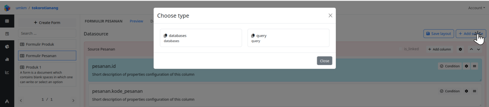
3. Ketik nama/label dari data source yang dibuat pada kolom ***Source Label*** dan klik tombol "Save Changes"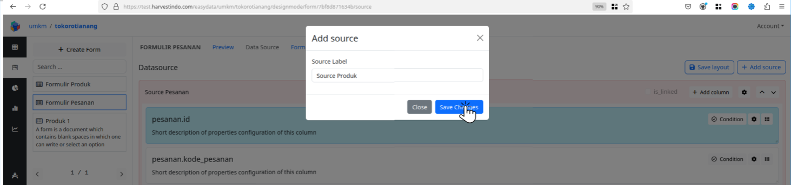
4. Data source yang baru dibuat akan ditampilkan pada urutan paling bawah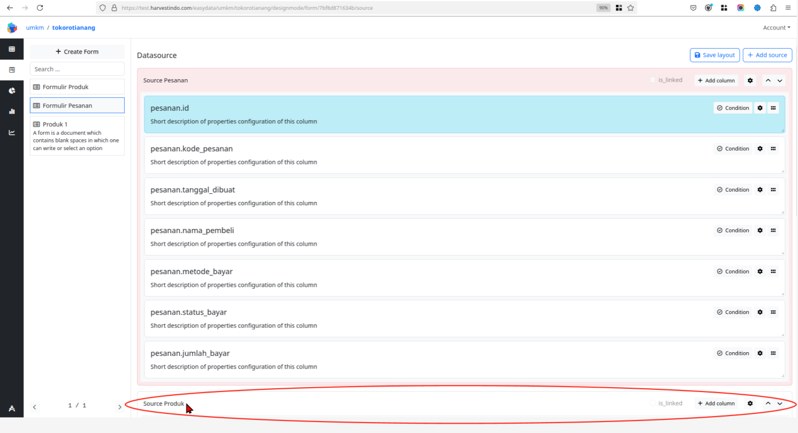

## Menambahkan kolom pada sumber data

1. Pada menu **Proyek > Desain > Formulir > Sumber Data**  *scroll* ke bagian bawah halaman untuk menemukan sumber data yang baru dibuat
2. Klik tombol "+Add Column" di dalam sumber data yang akan ditambahkan kolom baru 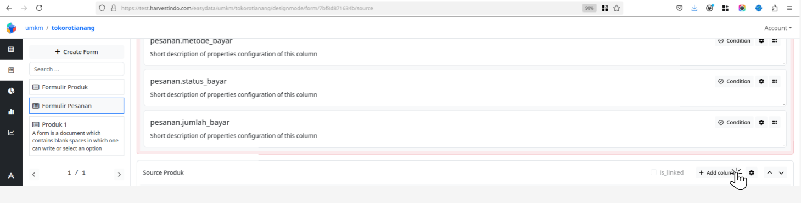
3. Pada jendela ***Add Source Column***, silahkan pilih kolom yang akan ditambahkan dan berikan keterangan label untuk kolom tersebut. 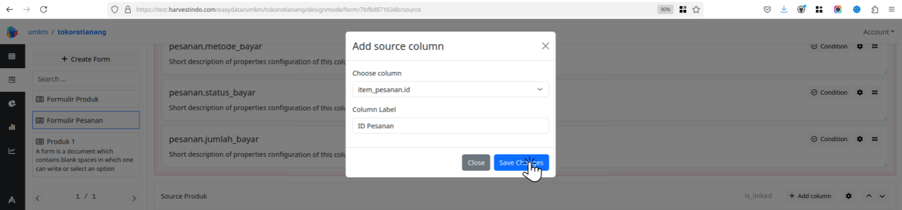
4. Klik tombol "**Save Changes**" dan lihat hasilnya pada urutan kolom paling bawah 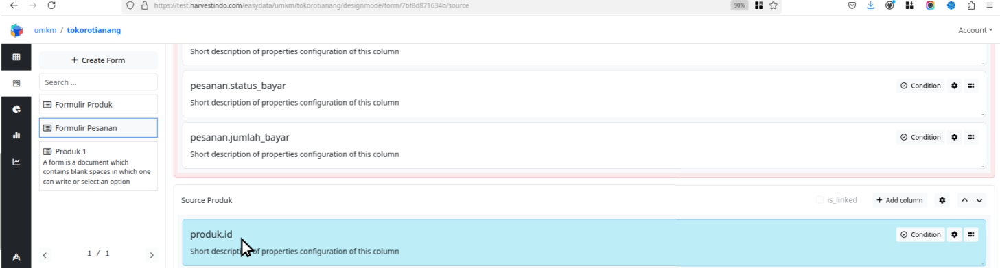

## Melakukan pengaturan pada sumber data

1. Pada menu **Proyek > Desain > Formulir > Sumber Data**, klik tombol dengan icon :gear:(Gear) pada bagian kanan atas sumber data yang ingin diatur 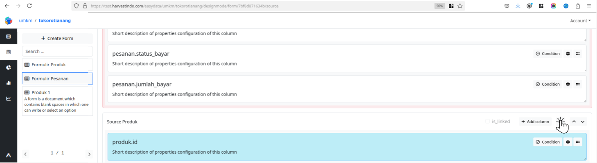
2. Pada jendela *Edit Data Source* terdapat beberapa pengaturan sebagai berikut: 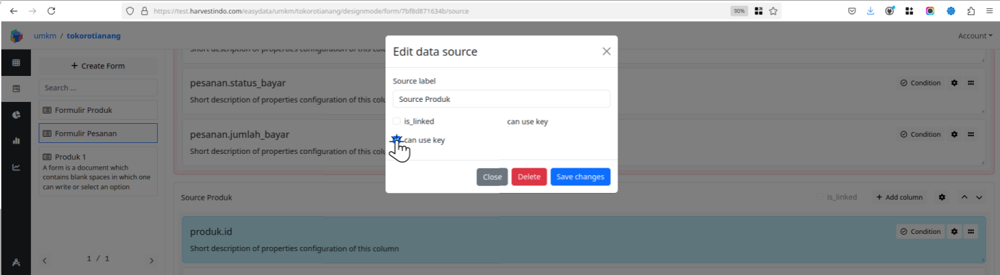
   1. Pada bagian ***Source Label*** anda dapat menuliskan label/nama/judul data source 
   2. Pada bagian ***is_linked*** anda dapat mengaktifkan/mencentang pada bagian *checkbox* untuk menghasilkan data sebagai berikut: 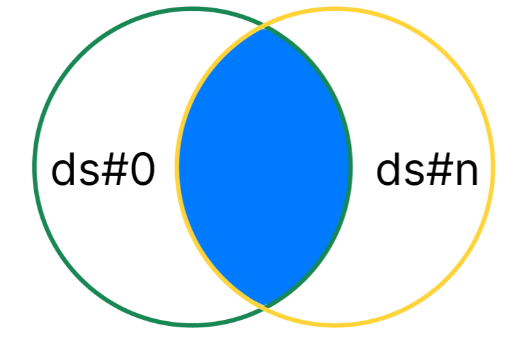
   3. Pada bagian ***can_use_key*** anda dapat mengaktifkan/mencentang pada bagian *checkbox* untuk menghasilkan data sebagai berikut: 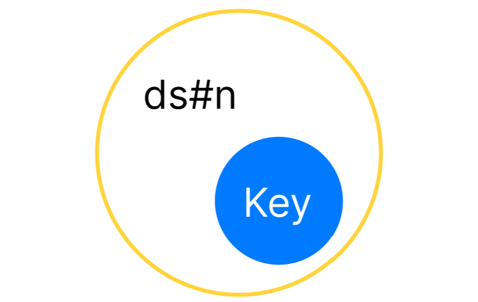
   4. Apabila pada bagian ***is_linked*** dan ***can_use_key*** keduanya diaktifkan/dicentang, makan akan menghasilkan data sebagai berikut: 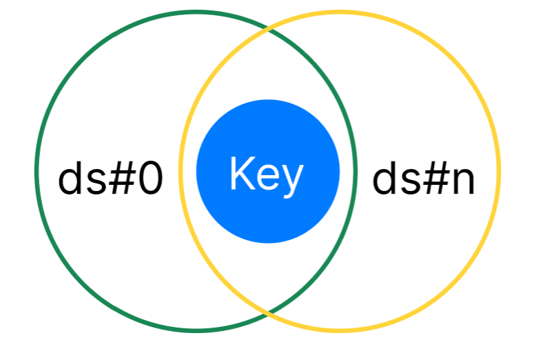
   5. Klik tombol "**Save Changes**" untuk menyelesaikan perubahan

## Melakukan pengaturan pada kolom di dalam sumber data

1. Pada menu **Proyek > Desain > Formulir > Sumber Data**, klik tombol dengan icon :gear:(Gear) pada bagian kanan kolom sumber data yang ingin diatur 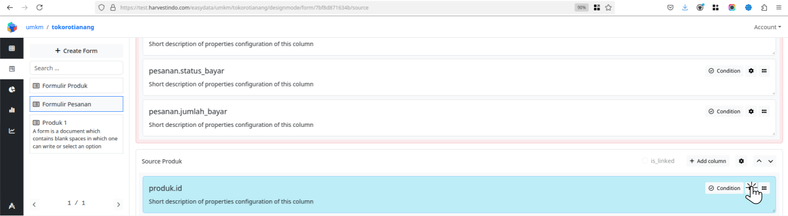 

2. Pada jendela *[Column_name = produk.id]* terdapat beberapa pengaturan sebagai berikut: 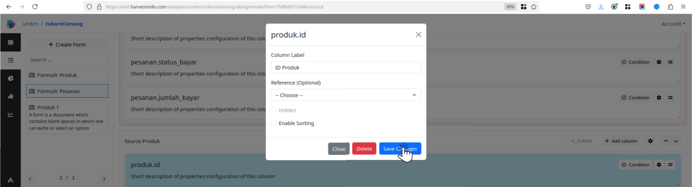

   1. *Column Label* adalah label/nama/judul kolom yang akan ditampilkan pada bagian kepala kolom di dalam tabel data.

   2. Pada bagian *Reference (Optional)* anda dapat memilih satu kolom dari sumber data lain untuk dijadikan sebagai kolom referensi, fungsinya mirip seperti ***Foreign Key*** . 

   3. Pada bagian ***Hidden*** anda dapat mengaktifkan/centang pada bagian *checkbox* untuk menyembunyikan kolom pada tampilan tabel data dan anda dapat menonaktifkan/kosongkan pada bagian *checkbox* untuk menampilkan kolom pada tampilan tabel data. Berikut skema yang terjadi jika anda mengaktifkan/menonaktifkan fitur ***Hidden*** pada kolom didalam data source:

      1. Pada menu formulir akan terjadi seperti pada skema berikut:

         |                |           | Form Table |          | Form Detail |          |                   |           |                            |          |
         | -------------- | --------- | ---------- | -------- | ----------- | -------- | ----------------- | --------- | -------------------------- | -------- |
         |                |           |            |          | **Init**    |          | **Element Table** |           | **Element Select with DS** |          |
         | **Datasource** | **State** | **Data**   | **View** | **Data**    | **View** | **Data**          | **View**  | **Data**                   | **View** |
         | Ds#0,col#0     | -         | Show       | Show     | Show        | Show     | Show              | Show      | Show                       | Show     |
         | Ds#0,col#n     | Hide      | Hide       | Hide     | Show        | Show     | Hide              | Hide      | Hide                       | Hide     |
         | Ds#0,col#n     | Show      | Show       | Show     | Show        | Show     | Show              | Show/Hide | Show                       | Show     |
         | Ds#n,col#0     | -         | -          | -        | Show        | Show     | Show              | Show      | Show                       | Show     |
         | Ds#n,col#n     | Hide      | -          | -        | Show        | Show     | Hide              | Hide      | Hide                       | Hide     |
         | Ds#n,col#n     | Show      | -          | -        | Show        | Show     | Show              | Show/Hide | Show                       | Show     |

         

      2. Pada menu **Laporan** akan terjadi seperti pada skema berikut: 

         |                |           | Report Table |          | Report Detail |          |                   |          |
         | -------------- | --------- | ------------ | -------- | ------------- | -------- | ----------------- | -------- |
         |                |           |              |          | **Init**      |          | **Element Table** |          |
         | **Datasource** | **State** | **Data**     | **View** | **Data**      | **View** | **Data**          | **View** |
         | Ds#0,col#0     | -         | Show         | Show     | Show          | Show     | Show              | Show     |
         | Ds#0,col#n     | Hide      | Hide         | Hide     | Show          | Show     | Hide              | Hide     |
         | Ds#0,col#n     | Show      | Show         | Show     | Show          | Show     | Show              | Show     |
         | Ds#n,col#0     | -         | -            | -        | Show          | Show     | Show              | Show     |
         | Ds#n,col#n     | Hide      | -            | -        | Show          | Show     | Hide              | Hide     |
         | Ds#n,col#n     | Show      | -            | -        | Show          | Show     | Show              | Show     |
   
         
   
   4. Pada bagian ***Enable Sorting*** anda dapat mengaktifkan/mencentang pada bagian *checkbox* untuk dapat menampilkan ikon *sorting* pada bagian *header* kolom di dalam tabel data dan mengaktifkan fitur *sorting* pada kolom tersebut 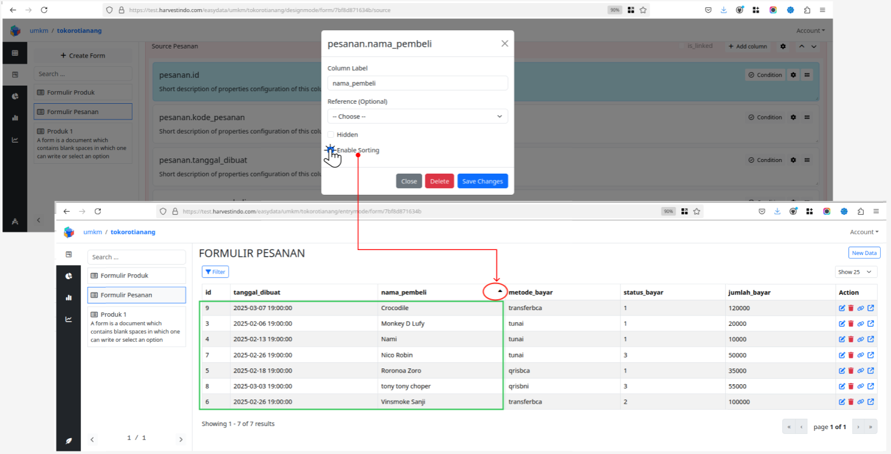
   
3. Klik tombol "***Save Changes***" untuk menyimpan perubahan