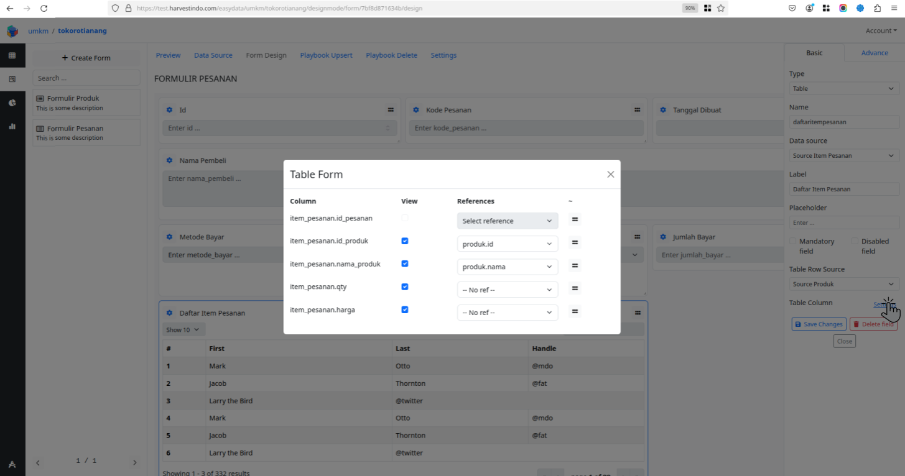
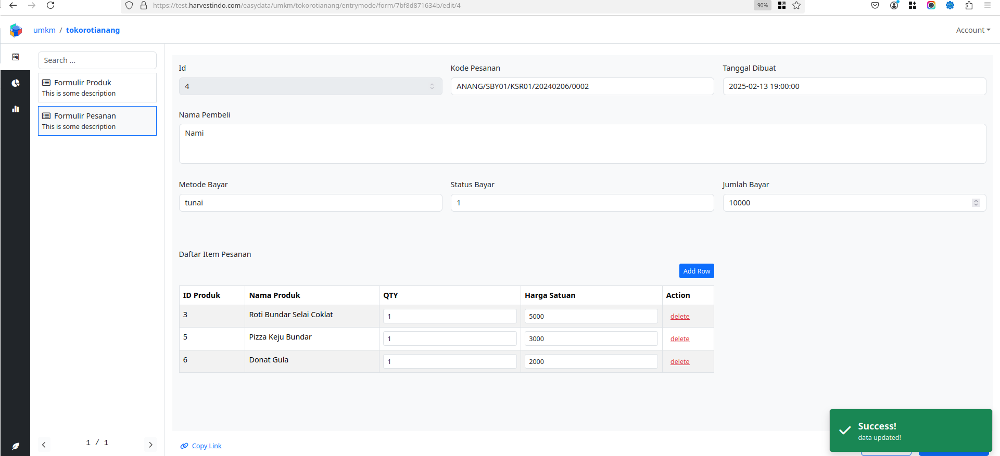

# Mendesain elemen tabel di dalam formulir

Silahkan buat studi kasus atau uraian kebutuhan anda sebelum melakukan  instruksi panduan tentang bagaiaman cara mendesain elemen tabel didalam  formulir. Pada panduan ini, studi kasus yang kami gunakan adalah sebagai berikut: 

> Pada panduan ini anda akan membuat formulir untuk mencatat pesanan pembeli pada sebuah toko roti. Setiap pesanan yang dibuat memiliki nomor/kode pesanan yang unik. Pembeli dapat menambahkan lebih dari satu produk pada satu formulir pesanan. Setiap produk yang dipesan harus mencantumkan jumlah yang ingin dipesan. Setiap produk yang dipesan akan mencantumkan harga satuan. Setiap formulir pesanan pembeli juga memuat informasi total harga yang harus dibayar. Berikut beberapa informasi yang akan dicatat dalam formulir pesanan pembeli: 
>
> - Kode pesanan
> - Waktu pesanan dibuat
> - Nama pembeli
> - Metode bayar
> - Status bayar
> - Nama produk
> - Harga produk
> - kuantitas produk yang dipesan(Qty)
> - Total bayar
>
> Sehingga pada panduan ini anda akan dapat membuat **Formulir Pesanan** yang berisi rincian informasi pesanan serta daftar rincian produk yang dipesan. Rincian informasi produk yang dipesan pada satu formulir pesanan akan dicatat pada **Tabel Item Pesanan** yang ada di dalam formulir pesanan. Kita dapat **menambahkan produk** ke dalam Tabel Item Pesanan atau **menghapus suatu produk** dari Tabel Item Pesanan pada setiap Formulir Pesanan.


## Mempersiakan tabel data yang akan digunakan dalam formulir

1. Buka menu **Proyek > Desain > Tabel** dan buat beberapa tabel berikut:
   1. Tabel **Pesanan** : Daftar pesanan pembeli 
      
   2. Tabel **Produk** : Daftar produk yang disediakan
      
   3. Tabel **Item Pesanan :** Daftar produk yang dipesan pada satu formulir pesanan
      
2. Buka menu **Proyek > Desain > Formulir** dan buat formulir baru dengan nama “**Formulir Produk**” untuk memasukkan data produk yang disediakan
   
3. Buka menu **Proyek > Entri > Formulir** dan tambahkan beberapa data produk dengan menambahkan data pada **Formulir Produk**
   
4. Buka menu **Proyek > Desain > Formulir** dan buat formulir baru dengan nama “**Formulir Pesanan**” yang didalamnya berisi data pesanan serta daftar produk yang dipesan dalam bentuk tabel yang akan kita buat pada langkah berikutnya …
   
5. Masuk ke **Formulir Pesanan** tab **Data Source** dan tambahkan beberapa source berikut dari tabel-tabel yang sudah dibuat pada <u>**langkah 1.1**</u> 
   
   1. Tambahkan **Source Produk** dari “**tabel produk**”  sebagai data produk yang akan ditambahkan pada **Tabel Item Pesanan** di dalam **Formulir Pesanan** 
   2. Tambahkan **Source Item Pesanan** dari **tabel item_pesanan** yang akan digunakan untuk menyimpan daftar produk yang dipesan di dalam **Formulir Pesanan** 


## Membuat elemen tabel pada desain formulir

1. Masuk ke menu **Desainer** → **Formulir** → **Formulir Pesanan** → **Desain Formulir** 

2. Tambahkan **Elemen Tabel** kedalam desain formulir

   1. Klik tombol “**Add Field**” dibagian kanan-atas halaman dan pilih **Elemen Tabel** 
       
   2. Lengkapi beberapa informasi terkait dengan **Elemen Tabel** dan klik **Save Changes** untuk menambahkan elemen ke desain formulir 
      
      1. Pada kolom “**Data Source**” isikan dengan memilih “**Source Item Pesanan**” sebagai sumber data untuk menyimpan dan menampilkan daftar prosuk yang dipesan pada masing-masing **Formulir Pesanan**
      2. Pada kolom “**Name**” isikan dengan menuliskan nama variabel tanpa karakter spasi[ ] dan menggunakan huruf kecil[a-z] semua. Silahkan tulis “**daftaritempesanan**” sebagai nama variable untuk memudahkan identifikasi pada langkah-langkah berikutnya
      3. Pada kolom “**Label**” isikan dengan menuliskan label yang akan ditampilkan sebagai judul dari elemen tabel. Silahkan menuliskan “**Daftar Item Pesanan**” sebagai label untuk memudahkan identifikasi pada langkah-langkah berikutnya

3. Buka jendela properti dari elemen tabel dengan klik icon roda gigi[ ⚙️ ] pada elemen tabel.
    

4. Pilih sumber data untuk ditampilkan sebagai daftar produk yang dipesan saat menambahkan item baru pada elemen tabel “Daftar Item Pesanan”. Pada jendela propersi elemen tabel bagian **Table Row Source** pilih **Source Produk** sebagai daftar produk untuk ditambahkan ke elemen tabel **Daftar Item Pesanan**.

   

5. Pada jendela properti elemen tabel bagian **Tabel Column**, klik tombol “Setting” untuk melakukan berbagai pengaturan pada elemen tabel **Daftar Item Pesanan** sebagaimana berikut:
   

   1. Perhatikan pada bagian “**Column**”, semua baris kolom yang yang ditampilkan merupakan kolom-kolom yang bersumber dari **Source Item Pesanan** yang sudah dipilih pada jendela pengaturan properti elemen tabel **Daftar Item Pesanan** bagian **Data Source** .
      
      
   2. Pada pengaturan **View** , Silahkan centak untuk menampilkan dan kosongkan untuk menyembunyikan kolom di dalam elemen tabel **Daftar Item pesanan**.
      

   3. Pada pengaturan **References**, Silahkan pilih kolom data yang nilainya akan disimpan pada masing-masing kolom di elemen tabel Daftar Item Pesanan ketika menambahkan data baru. 
      
      
      Pastikan kolom-kolom yang dapat dipilih adalah kolom-kolom yang bersumber dari **Source Produk** yang sudah dipilih pada pengaturan properti elemen tabel Daftar Item Pesanan bagian **Table Row Source.** 
      

6. Klik tombol “Save Changes” pada jendela properti elemen tabel **Daftar Item Pesanan** untuk menyimpan perubahan.
      

7. Buka menu **Entry → Formulir → Formulir Pesanan → New Data** untuk memastikan formulir telah memiliki elemen tabel didalamnya. Kemudian coba tambahkan baris data baru ke dalam elemen tabel **Daftar Item Pesanan**

​    


## Mendesain Playbook untuk dapat mengelola data dari elemen tabel didalam formulir

1. Buka menu **Desainer > Formulir > Formulir Pesanan > Playbook Upsert** 

2. Buka jendela pengaturan properti tugas **Formulir Pesanan - Upsert** pada kolom **Register** tuliskan kata untuk diregistrasikan sebagai variabel agar bisa digunakan dalam tugas lain pada langkah selanjutnya
   

3. Buat tugas baru dengan tipe **SQL Retrieve Query** dan lakukan pengaturan sebagai berikut: 
   Perhatikan beberapa hal berikut untuk melakukan pengaturan pada tugas SQL Retrieve Query pada langkah ini: 

   1. Pada kolom **SQL Query** perhatikan susunan perintah SQL yang dituliskan berikut:

      ```
      select [kolom1, kolom2, ..] from [nama_tabel] where [kolom_A]=[{form.variabel_A}]
      ```

      1. Pada bagian **[kolom1, kolom2, ..]** tuliskan nama-nama kolom yang ingin diambil atau lebih mudah **tuliskan tanda bintang[\*]** untuk mengambil semua kolomya.
      2. Pada bagian **[nama_tabel]** tuliskan nama tabel sumber data dari elemen tabel Daftar Item Pesanan di dalam formulir yaitu **item_pesanan** 
      3. Pada bagian **[kolom_A]** tuliskan nama kolom yang dijadikan Foreign Key pada tabel sumber data dari elemen tabel Daftar Item Pesanan yaitu **id_pesanan** 
      4. Pada bagian **[{form.variable_A}]** Masukkan nama variable dari element input pada formulir yang kolom sumber datanya dijadikan sebagai Primary Key dengan klik salah satu variabel yang tersedia pada daftar **Form Variable** yaitu variabel **Id**. Nama variabel yang akan dituliskan pada kolom SQL Query yaitu {form.[nama variabel]}, misal nama variabel inputnya adalah **d9b5df392eae_pesanan_id** akan dituliskan **{form.d9b5df392eae_pesanan_id}** 

   2. Pada kolom **Register** tuliskan sebuah kata tanpa spasi[ ] untuk diregistrasikan sebagai **nama variable** dari tugas **SQL Retrieve Query** ini, misalnya **retrievedaftaritempesanan**

4. Buat tugas baru dengan tipe **Array Diff** dan lakukan pengaturan sebagai berikut: 
   Perhatikan beberapa hal berikut untuk melakukan pengaturan pada tugas Array Diff pada langkah ini: 

   1. Pada bagian **Diff** klik tombol “**Old data**” dan masukkan variabel yang sudah diregistrasi pada tugas **SQL Retrieve Data** dengan cara klik variable **retrievedaftaritempesanan** pada daftar Registered Variable ke dalam kolom fungsi(fx) dibagian atas 

   2. Pada bagian **Diff** klik tombol “**New data**” dan tuliskan fungsi berikut: 

      ```
      {form.[nama_elemen_tabel]}
      ```

      Pada langkah ini bagian **[nama_elemen_tabel]** tuliskan nama input elemen tabel **Daftar Item Pesanan** yaitu **daftaritempesanan**

   3. Pada bagian **Mapping (Priority Order)** buat pengaturan sebagai berikut: 

      1. Pada kolom **Old Key** tuliskan nama-nama kolom dari tabel item_pesanan yang akan digunakan untuk mapping
      2. Pada kolom **New Key** tuliskan nama-nama kolom dari daftar kolom pada **pengaturan elemen tabel → Table Column** yang akan digunakan untuk mapping yaitu **item_pesanan_id_pesanan** dan **item_pesanan_id_produk**. Perhatikan apabila ada karakter titik[.] pada nama kolom tersebut, silahkan digantik dengan karakter *underscores*[ _ ].

   4. Pada bagian **Register** tuliskan nama variabel tanpa spasi[ ] untuk diregistrasikan sebagai variabel yang dapat digunakan dalam tugas-tugas di langkah selanjutnya 

5. Buat tugas baru dengan tipe **SQL Upsert** dan lakukan pengaturan sebagai berikut: 
   Perhatikan beberapa hal berikut untuk melakukan pengaturan pada tugas SQL Upsert untuk elemen tabel Daftar Item Pesanan  pada langkah ini: 

   1. Pada bagian **Table** pilih tabel yang digunakan untuk menyimpan data yang dikirimkan dari elemen tabel Daftar Item Pesanan pada desain formulir yaitu tabel **item_pesanan** 

   2. Pada bagian **Column** dan **Value**, tambahkan semua kolom dari tabel **item_pesanan** dan value yang ingin dimasukkan ke masing-masing kolom sebagai berikut: 

      Pada **Variable1** untuk kolom pertama yaitu **id_pesanan**, pada bagian **formula(fx)** tuliskan nama variabel yang telah diregistrasikan pada tugas Formulir Pesanan - Upsert yaitu **daftarformulirpesanan** dengan cara klik variabel pada bagian **Registered Variable** 

      Pada bagian **Value** juga dapat menuliskan variabel secara langsung pada bagian **Formula(fx)** dengan struktur sebagai berikut: 

      ```
      {item.value.[nama variabel input]}
      ```

      Penulisan seperti diatas diterapkan pada **Variable2, Variable3, Variable…n** untuk mengambil nilai yang dikirim dari elemen tabel Daftar Item Pesanan di dalam formulir. 

      Pada bagian **[nama variabel input]** ganti dengan nama kolom-kolom input dari elemen tabel **Daftar Item Pesanan** pada desain formulir 

   3. Pada bagian **Record Identifier** tambahkan kolom-kolom yang menjadi **Identifier** dan value dari masing-masing kolom pada daftar **Column** dan **Value** sebagai berikut: 

   4. Klik tombol “**Save Changes**” untuk menyimpan perubahan

6. Buka jendela pengaturan **Loop** pada tugas **SQL Upsert untuk Daftar Item Pesanan** dan lakukan pengaturan sebagai berikut 

   Pada **Variable 1** dibagian formula(fx) tuliskan **nama variabel** yang telh diregistrasikan diikuti **.upsert** di dalam kurung kurawal( {} ) dengan struktur sebagai berikut:

   ```
   {[nama_variabel].upsert}
   ```

   Pada bagian **[nama_variabel]** ganti dengan nama variabel yang sudah diregistrasi di dalam tugas **ArrayDiff Daftar Item Pesanan** yaitu **diffdaftaritempesanan** atau klik nama variabel di bagian **Registered Variable**. Kemudian klik tombol “**Save Changes**” untuk menyimpan perubahan

7. Buat tugas baru dengan tipe **SQL Delete** dan lakukan pengaturan sebagai berikut: 
   Perhatikan beberapa hal berikut untuk melakukan pengaturan pada tugas SQL Delete untuk elemen tabel Daftar Item Pesanan  pada langkah ini: 

   1. Pada bagian **Table** pilih tabel yang digunakan untuk menyimpan data yang dikirimkan dari elemen tabel Daftar Item Pesanan pada desain formulir yaitu tabel **item_pesanan** 

   2. Pada bagian **Record Identifier** tambahkan kolom-kolom yang menjadi **Identifier** dan value dari masing-masing kolom pada daftar **Column** dan **Value** sebagai berikut: 
      Pada bagian **Value**, tuliskan variabel secara langsung pada bagian **Formula(fx)** dengan struktur sebagai berikut:

      ```
      {item.value.[nama variabel input]}
      ```

      Pada bagian **[nama variabel input]** ganti dengan nama kolom-kolom input dari elemen tabel **Daftar Item Pesanan** pada desain formulir 

   3. Klik tombol “**Save Changes**” untuk menyimpan perubahan

8. Buka jendela pengaturan **Loop** pada tugas **SQL Delete untuk Daftar Item Pesanan** dan lakukan pengaturan sebagai berikut:
   Pada **Variable 1** dibagian formula(fx) tuliskan **nama variabel** yang telh diregistrasikan diikuti **.upsert** di dalam kurung kurawal( {} ) dengan struktur sebagai berikut: 

   ```
   {[nama_variabel].upsert}
   ```

   Pada bagian **[nama_variabel]** ganti dengan nama variabel yang sudah diregistrasi di dalam tugas **ArrayDiff Daftar Item Pesanan** yaitu **diffdaftaritempesanan** atau klik nama variabel di bagian **Registered Variable**. Kemudian klik tombol “**Save Changes**” untuk menyimpan perubahan

9. Buat urutan tugas-tugas yang sudah dibuat menjadi seperti berikut:

10. Klik tombol “Save Changes” pada bagian atas daftar tugas untuk menyimpan seluruh perubahan


## Mengelola data pada elemen tabel di dalam formulir dan menimpannya

1. Buka formulir untuk entri data pada menu **Entry → Formulir Pesanan**
2. Tambahkan data baru dengan mengikuti langkah-langkah berikut:
   1. Pada halaman **Formulir Pesanan** klik tombol “New Data” pada bagian kanan-atas halaman
   2. Lengkapi semua informasi pada kolom-kolom input di dalam formulir
   3. Tambahkan baris data baru pada elemen tabel **Daftar Item Pesanan** dengan klik tombol “Add Row” pada bagian kanan-atas tabel
   4. Pilih baris data yang ingin ditambahkan dengan cara klik tombol “Select” pada baris data yang ingin ditambahkan 
   5. Lengkapi semua kolom input pada baris data yang baru ditambahkan pada elemen tabel **Daftar Item Pesanan** 
   6. Klik tombol “Save Changes” untuk menyimpan perubahan
3. Mengelola data pada elemen tabel **Daftar Item Pesanan** di dalam **Formulir Pesanan**
   1. Buka menu **Formulir Pesanan** dan klik tombol “Edit” Pada baris data yang ingin dikelola 
   2. Tambahkan beberapa baris data baru pada elemen tabel **Daftar Item Pesanan** 
   3. Klik tombol “Save Changes” untuk menyimpan perubahan 
   4. Hapus baris data pada elemen tabel **Daftar Item Pesanan** dengan cara klik tombol “Delete” pada baris data yang ingin dihapus 
   5. Klik tombol “Save Changes” untuk menyimpan perubahan 
